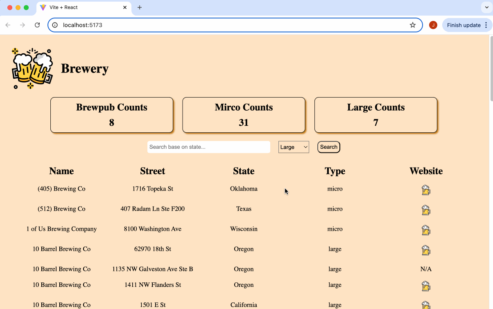

# Web Development Project 5 - _Dashboard: Brewery_

Submitted by: **Jing Wang**

This web app: **A brewery data dashboard that provides an at-a-glance summary of information gathered from a public API, [openbrewerydb.org](https://www.openbrewerydb.org/). The dashboard view contains summary statistics and a list view of the data that can be searched and filtered.**

Time spent: **3** hours spent in total

## Required Features

The following **required** functionality is completed:

- [x] **The site has a dashboard displaying a list of data fetched using an API call**
  - The dashboard should display at least 10 unique items, one per row
  - The dashboard includes at least two features in each row
- [x] **`useEffect` React hook and `async`/`await` are used**
- [x] **The app dashboard includes at least three summary statistics about the data**
  - The app dashboard includes at least three summary statistics about the data, such as:
    - _insert details here_
- [x] **A search bar allows the user to search for an item in the fetched data**
  - The search bar **correctly** filters items in the list, only displaying items matching the search query
  - The list of results dynamically updates as the user types into the search bar
- [x] **An additional filter allows the user to restrict displayed items by specified categories**
  - The filter restricts items in the list using a **different attribute** than the search bar
  - The filter **correctly** filters items in the list, only displaying items matching the filter attribute in the dashboard
  - The dashboard list dynamically updates as the user adjusts the filter

The following **optional** features are implemented:

- [ ] Multiple filters can be applied simultaneously
- [x] Filters use different input types
  - e.g., as a text input, a dropdown or radio selection, and/or a slider
- [ ] The user can enter specific bounds for filter values

## Video Walkthrough

Here's a walkthrough of implemented user stories:

GIF created with LICEcap

## Notes

The project came together nicely overall. The main challenge I faced was handling the dynamic API requests, constructing the appropriate URL endpoints when users search by state or filter by brewery type.

## License

    Copyright [2025] [Jing Wang]

    Licensed under the Apache License, Version 2.0 (the "License");
    you may not use this file except in compliance with the License.
    You may obtain a copy of the License at

        http://www.apache.org/licenses/LICENSE-2.0

    Unless required by applicable law or agreed to in writing, software
    distributed under the License is distributed on an "AS IS" BASIS,
    WITHOUT WARRANTIES OR CONDITIONS OF ANY KIND, either express or implied.
    See the License for the specific language governing permissions and
    limitations under the License.
